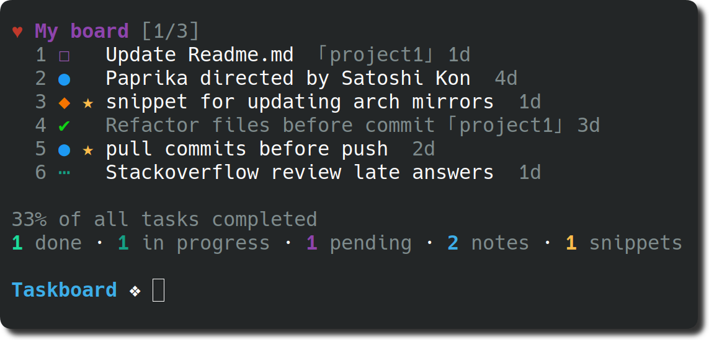

<h1 align="center">
  Taskboard
</h1>

<h4 align="center">
  Tasks, boards, notes and code snippets for the command-line environment
</h4>

<div align="center">
  
</div>


## Description

By utilizing a simple and minimal usage syntax, that requires a flat learning curve, **Taskboard** helps you to effectively manage your tasks and notes and code snippets across multiple boards from within your terminal. All Data has stored locally so never shared with anyone or anything. Deleted items are automatically archived and can be inspected or restored at any moment.

## Highlights

- Organize tasks, notes and code snippets to boards
- Board & timeline views
- Priority & favorite mechanisms
- Coloured Search & filter items
- Archive & restore deleted items
- Lightweight & fast
- Data written atomically to storage
- Custom storage location
- Progress overview
- Simple & minimal usage syntax
- Update notifications
- Configurable through `~/.taskboard.conf`
- Data stored in JSON file at `~/.taskboard/tasks.json`


## Contents

- [Description](#description)
- [Highlights](#highlights)
- [Install](#install)
- [Usage](#usage)
- [Views](#views)
- [Configuration](#configuration)
- [Flight Manual](#flight-manual)
- [License](#license)

## Install

### Pip

```bash
pip install taskboard
```
## Usage

```
Usage
    none             •    Display board view
    t  - task        •    Create a task
    n  - note        •    Create a note
    sn - snippet     •    Create a code snippet
    b  - begin       •    Start/pause task
    c  - check       •    Check/uncheck task
    e  - edit        •    Edit item description
    d  - delete      •    Delete an item
    f  - find        •    Search in item's descriptions
    s  - star        •    Star/unstart item
    p  - priority    •    Update priority of an item (*1, *2, *3)
    m  - move        •    Move item between boards
    l  - list        •    List boards with their items
    y  - copy        •    Copy an item description
    a  - archive     •    Display archived items
    r  - restore     •    Restore item from archive
    v  - view        •    View code snippet's content
    at - attach      •    Attach an item to a board
    cc - copycon     •    Copy code snippet's content
    ec - editcon     •    Edit code snippet's content (in editor)
    fc - findcon     •    Search in code snippets' contents
    rf - refactor    •    Refactor items (resets their ids)
    cl - clear       •    Refactor and delete checked items, archive 
    tl - timeline    •    Display timeline view
    sw - switch      •    Switch to a board
    h -  help        •    Display help message
    ex - examples    •    Display helping examples
    exit             •    Just exit 


  Examples
    These commands needs arguments:
      
      task Update Readme.md @project
      note Thinking: the talking of the soul with itself -Plato 
      snippet Code for updating Arch mirrors @arch  
      begin 1 2   
      check 4 6 1
      edit 2 Resolve merge conflict
      delete 2 6 7 4
      find git
      priority 4 2 *2
      move 3 fix
      copy 7
      restore 5 6
      view 6
      attach 3 coding
      copycon 5
      editcon 3
      findcon 10 print

    Other commands don't need arguments so you can try them out easily
```

## Views

### Board View

Invoking taskboard without any options will display `My Board`. If you want to list all items with their corresponding boards, use `list`/`l` option.

### Timeline View

In order to display all items in a timeline view, based on their creation date, the `timeline`/`tl` option can be used.

## Configuration

To configure taskboard navigate to the `~/.taskboard.json` file and modify any of the options to match your own preference. To reset back to the default values, simply delete the config file from your home directory.

The following illustrates all the available options with their respective default values.

```json
{
  "taskboardDirectory": "~",
}
```

## Flight Manual

The following is a minor walkthrough containing a set of examples on how to use taskboard.

### Create Task

To create a new task use the `task`/`t` option with your task's description following right after.

```
$ Taskboard: Update Readme.md
```

### Create Note

To create a new note use the `note`/`n` option with your note's body following right after.

```
Taskboard: n Life must be lived as play -Plato 
```

### Create Snippet

To create a new code snippet use the `snippet`/`sn` option with your snippet'a body following right after.You will be sent to your editor which is set by $EDITOR variable in your system. If $EDITOR value is empty, Taskboard will search other editors in your system and open that when finds it.

```
Taskboard: sn Code for updating Arch mirrors @arch
```

### Create Board

Boards are automatically initialized when creating a new task or note. To create one or more boards, include their names, prefixed by the `@` symbol, in the description of the about-to-be created item. As a result the newly created item will belong to all of the given boards. By default, items that do not contain any board names in their description are automatically added to the general purpose; `My Board`.

```
Taskboard: sn Code for updating Arch mirrors @arch
```

### Check Task

To mark a task as complete/incomplete, use the `check`/`c` option followed by the ids of the target tasks. Note that the option will update to its opposite the `complete` status of the given tasks, thus checking a complete task will render it as pending and a pending task as complete.

```
Taskboard: c 1 3
```

### Begin Task

To mark a task as started/paused, use the `begin`/`b` option followed by the ids of the target tasks. The functionality of this option is the same as the one of the above described `check` option.

```
Taskboard: b 2 3
```

### Star Item

To mark one or more items as favorite, use the `star`/`s` option followed by the ids of the target items. The functionality of this option is the same as the one of the above described `check` option.

```
Taskboard: s 1 2 3
```

### Edit Item

To edit an item use the `edit`/`e` option followed by the id of target item, followed by the new description.

```
Taskboard: e Update README
```

### Move Item

To move an item to one or more boards, use the `move`/`m` option, followed by the target item id, followed by board name. The default `My board` can be accessed through the leaving empty in place of board name.

```
Taskboard: m 1 coding
```

### Delete Item

To delete one or more items, use the `delete`/`d` options followed by the ids of the target items. Note that deleted items are automatically archived, and can be inspected or restored at any moment.

```
Taskboard: d 1 2
```

### Copy Item Description

To copy to your system's clipboard the description of an item, use the `copy`/`y` option followed by the id of the target item.

``` 
Taskboard: copy 1 
```

### Search Items

To search for one of more items, use the `find`/`f` option, followed by your search terms.

```
Taskboard: f review
```

### Set Priority

To update the priority level of a specific task after its creation, use the `priority`/`p` option along with the ids of target tasks, prefixed by the `*` symbol, and an integer of value `1`, `2` or `3`. 

- `1` - Normal priority
- `2` - Medium priority
- `3` - High priority

```
Taskboard: p 5 *3
```

### Display Archive

To display all archived items, use the `archive`/`a` option.

```
Taskboard: archive
```

### Restore Items

To restore one or more items, use the `restore`/`r` option followed by the ids of the target items. 

```
Taskboard: r 4 2
```

### Refactor Items

To reset all items' ids, use the `refactor/rf` option. This option will renumber items starting from 0.  
```
Taskboard: refactor
```


### Clear Items

This option will delete checked items and archive. Also note that it will refactor after deleting so you don't need to trigger `refactor` option  
```
Taskboard: clear 
```

### View Code Snippet

To display content of the code snippet, use the `view/v` option. 
```
Taskboard: v 3 
```

### Attach Item To Board

To add an item to a board, use `attach/at` option followed by ids of the items followed by board name. This will add specified items to the specified board.   

```
Taskboard: at 3 5 coding 
```

### Copy Snippet Content

To copy to your system's clipboard the content of the code snippet, use the `copycon`/`cc` option followed by the id of the target snippet.

``` 
Taskboard: cc 3 
```

### Edit Snippet Content

To edit a snippet's content use the `editcon`/`ec` option followed by the id of target snippet. You will be sent to your favourite editor to edit snippet's content. When you finish editing, you can save and exit from the editor.

``` 
Taskboard: ec 4 
```

### Search in Snippet Content

To search a keyword in snippets' contents, use the `findcon`/`fc` option, followed by your search term. This will print all matched result with their corresponding snippet description.

``` 
Taskboard: fc if 
```

### Switch to Board

To switch to specific board, use `switch/sw` option followed by board name. This will display that specific board and adding items will automatically set to that board. If board name is left blank, Taskboard will switch to `My board`.  


``` 
Taskboard: sw coding 
```

## Thanks

Thanks to [klaussinani](https://github.com/klaussinani) and his amazing work [taskbook](https://github.com/klaussinani/taskbook) for inspiring me while doing this project.

## License

[MIT](https://github.com/Marceliny/Taskboard/blob/master/LICENSE.txt) 
